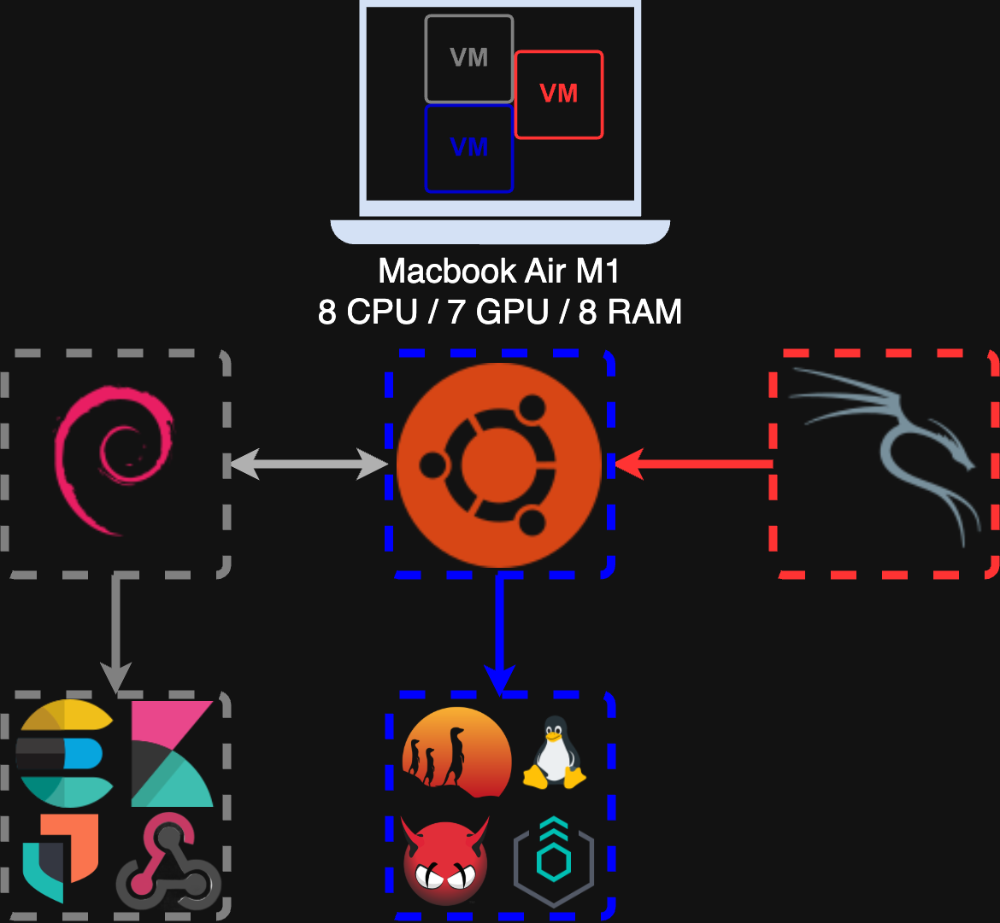

# Architecture Overview

This document provides a high-level overview of the TinySOC lab architecture.

## Lab Host

- **Macbook Air M1** (8 CPU / 7 GPU / 8 RAM)
- Runs several virtual machines (VMs) for different roles:
    - **Ubuntu** (Core SOC VM)
    - **Debian** (Logging/Monitoring VM)
    - **Kali Linux** (Attacker VM)

## Main Components

- **Elastic Stack** (Elasticsearch, Kibana)
- **Elastic Agent (Standalone mode)**
- **auditd**
- **Suricata**
- **ClamAV**
- **Custom scripts**

## High-Level Data Flow

- Logs and events from auditd, Suricata, and ClamAV are collected by Elastic Agent in standalone mode.
- Elastic Agent sends data directly to Elasticsearch.
- Data is visualized and analyzed in Kibana.
- Attacker VM (Kali) simulates threats and generates events for detection.

See [components.md](./components.md) for a breakdown of each component.
